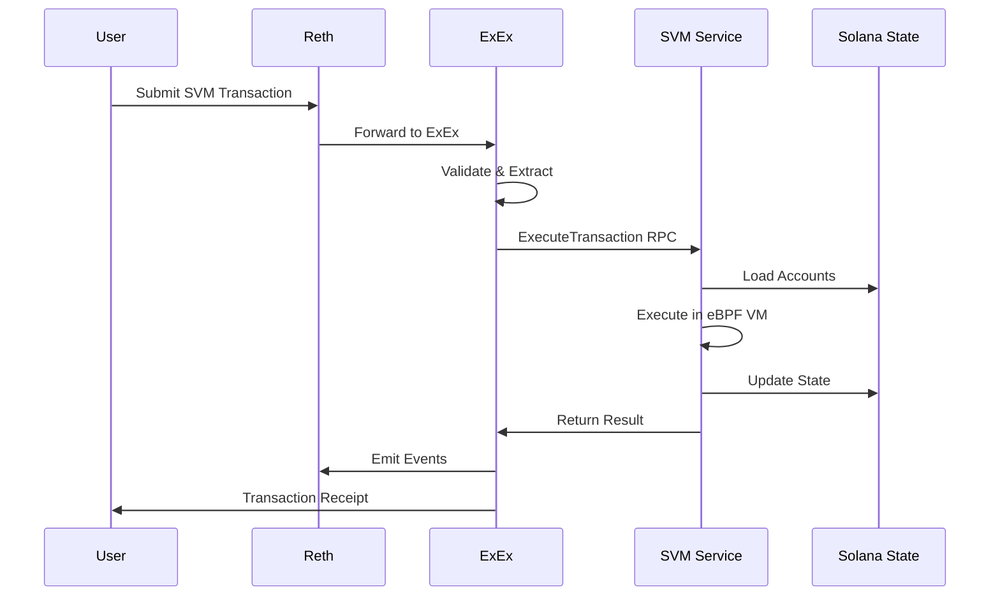

# Modular SVM Architecture for Monmouth SVM ExEx

## Executive Summary

This document outlines the architecture for implementing a modular Solana Virtual Machine (SVM) that runs as a separate service, communicating with the Reth ExEx via gRPC. This approach provides better scalability, maintainability, and protocol compliance compared to an embedded SVM implementation.

## Table of Contents

1. [Architecture Overview](#architecture-overview)
2. [Design Rationale](#design-rationale)
3. [System Components](#system-components)
4. [Communication Protocol](#communication-protocol)
5. [Transaction Flow](#transaction-flow)
6. [Implementation Strategy](#implementation-strategy)
7. [Performance Considerations](#performance-considerations)
8. [Security Model](#security-model)
9. [Deployment Architecture](#deployment-architecture)
10. [Migration Path](#migration-path)

## Architecture Overview

The modular SVM architecture separates the Solana Virtual Machine from the Reth ExEx, allowing for independent scaling, deployment, and maintenance. This design follows the principles outlined in Anza's SVM specification and aligns with successful implementations like Rome and Eclipse.

```
┌─────────────────┐         gRPC          ┌─────────────────┐
│                 │◄──────────────────────►│                 │
│   Reth ExEx     │                        │   SVM Service   │
│  (Orchestrator) │                        │   (Executor)    │
│                 │                        │                 │
└─────────────────┘                        └─────────────────┘
        │                                           │
        │                                           │
        ▼                                           ▼
┌─────────────────┐                        ┌─────────────────┐
│ Ethereum State  │                        │  Solana State   │
│   Management    │                        │   Management    │
└─────────────────┘                        └─────────────────┘
```

## Design Rationale

### Why Separate SVM?

1. **Scalability**: Multiple SVM instances can process transactions in parallel
2. **Protocol Compliance**: Direct use of `solana-svm` crate ensures compatibility
3. **Resource Isolation**: SVM compute doesn't impact ExEx performance
4. **Maintainability**: Independent updates and deployments
5. **Flexibility**: Easy switching between local and remote execution

### Benefits Over Embedded Approach

| Aspect | Embedded SVM | Modular SVM |
|--------|--------------|-------------|
| Scalability | Limited to single instance | Horizontal scaling |
| Updates | Requires ExEx restart | Hot-swappable |
| Resource Usage | Shared with ExEx | Isolated |
| Debugging | Complex | Simplified |
| Protocol Updates | Coupled | Independent |

## System Components

### 1. SVM Service

The standalone SVM service built on Anza's `solana-svm` crate:

```rust
// Core SVM service structure
pub struct SvmService {
    // Transaction processor from solana-svm
    processor: TransactionBatchProcessor,
    
    // State management
    accounts_db: AccountsDb,
    bank_forks: BankForks,
    
    // gRPC server
    grpc_server: SvmGrpcServer,
    
    // Metrics and monitoring
    metrics: SvmMetrics,
}
```

### 2. ExEx SVM Client

The client component within the Reth ExEx:

```rust
pub struct SvmClient {
    // Connection pool to SVM services
    connection_pool: Arc<ConnectionPool>,
    
    // Transaction routing
    router: TransactionRouter,
    
    // State synchronization
    state_sync: StateSync,
}
```

### 3. Communication Layer

Enhanced gRPC protocol for SVM operations:

```protobuf
service SvmExecutor {
    // Execute a single transaction
    rpc ExecuteTransaction(SvmTransaction) returns (SvmExecutionResult);
    
    // Execute a batch of transactions
    rpc ExecuteBatch(SvmTransactionBatch) returns (SvmBatchResult);
    
    // State management
    rpc GetAccountState(AccountQuery) returns (AccountState);
    rpc CommitState(StateCommit) returns (CommitResult);
    
    // Health and monitoring
    rpc HealthCheck(Empty) returns (HealthStatus);
}
```

## Communication Protocol

### Message Types

Extend the existing `InterExExProtocol` with SVM-specific messages:

```rust
pub enum SvmMessageType {
    // Transaction execution
    ExecuteTransaction,
    TransactionResult,
    
    // Batch processing
    ExecuteBatch,
    BatchResult,
    
    // State management
    StateQuery,
    StateUpdate,
    StateCommit,
    
    // Synchronization
    Checkpoint,
    Rollback,
}
```

### Protocol Flow

1. **Transaction Receipt**: ExEx receives SVM transaction from Ethereum
2. **Validation**: Basic validation in ExEx
3. **Forwarding**: Send to SVM service via gRPC
4. **Execution**: SVM processes transaction
5. **Result Return**: Execution results sent back to ExEx
6. **State Update**: ExEx updates local state tracking

## Transaction Flow

### Detailed Transaction Processing



### Batch Processing

For efficiency, transactions can be batched:

```rust
pub struct TransactionBatch {
    pub slot: Slot,
    pub transactions: Vec<SvmTransaction>,
    pub execution_config: ExecutionConfig,
}

pub struct ExecutionConfig {
    pub parallel_execution: bool,
    pub max_compute_units: u64,
    pub preflight_checks: bool,
}
```

## Implementation Strategy

### Phase 1: Foundation (Week 1-2)

1. **Create SVM Service Wrapper**
   ```rust
   // svm_service/src/main.rs
   use solana_svm::transaction_processor::TransactionBatchProcessor;
   
   #[tokio::main]
   async fn main() -> Result<()> {
       let processor = TransactionBatchProcessor::new();
       let server = SvmGrpcServer::new(processor);
       server.serve().await
   }
   ```

2. **Define gRPC Protocol**
   ```protobuf
   // proto/svm_executor.proto
   syntax = "proto3";
   package svm_executor;
   
   message SvmTransaction {
       bytes data = 1;
       uint64 slot = 2;
       repeated AccountKey accounts = 3;
   }
   ```

### Phase 2: Integration (Week 3-4)

1. **Update ExEx to Use SVM Client**
   ```rust
   impl EnhancedSvmExEx {
       pub async fn process_svm_transaction(&self, tx: &[u8]) -> Result<SvmExecutionResult> {
           // Use SVM client instead of embedded processor
           self.svm_client.execute_transaction(tx).await
       }
   }
   ```

2. **Implement Connection Pooling**
   ```rust
   pub struct SvmConnectionPool {
       connections: Vec<SvmConnection>,
       load_balancer: LoadBalancer,
   }
   ```

### Phase 3: Production Features (Week 5-6)

1. **State Synchronization**
   - Implement checkpoint/rollback mechanism
   - Add state merkle proof verification

2. **Monitoring & Observability**
   - Prometheus metrics
   - Distributed tracing
   - Health checks

## Performance Considerations

### Optimization Strategies

1. **Connection Pooling**: Maintain persistent gRPC connections
2. **Batch Processing**: Group transactions for efficiency
3. **Caching**: Cache frequently accessed accounts
4. **Parallel Execution**: Multiple SVM instances for parallel processing

### Benchmarks Target

| Metric | Target | Current (Embedded) |
|--------|--------|-------------------|
| Single TX Latency | <10ms | ~15ms |
| Batch Throughput | 10K TPS | 5K TPS |
| State Sync Time | <100ms | N/A |

### Resource Requirements

```yaml
# SVM Service Requirements
svm_service:
  cpu: 8 cores
  memory: 32GB
  disk: 500GB NVMe
  network: 10Gbps
  
  # Scaling
  min_instances: 2
  max_instances: 10
  target_cpu_utilization: 70%
```

## Security Model

### Authentication & Authorization

1. **mTLS for gRPC**: Mutual TLS between ExEx and SVM
2. **API Keys**: Rotatable keys for service authentication
3. **Rate Limiting**: Prevent DoS attacks

### Transaction Security

```rust
pub struct SecureTransaction {
    pub transaction: SvmTransaction,
    pub signature: Signature,
    pub nonce: u64,
    pub timestamp: u64,
}
```

### State Security

1. **Merkle Proofs**: Verify state transitions
2. **Checkpoints**: Regular state snapshots
3. **Audit Logs**: Complete transaction history

## Deployment Architecture

### Docker Compose Development

```yaml
version: '3.8'
services:
  svm-service:
    build: ./svm-service
    ports:
      - "50051:50051"
    environment:
      - RUST_LOG=info
      - SVM_ACCOUNTS_DB=/data/accounts
    volumes:
      - svm-data:/data
    
  reth-exex:
    build: .
    environment:
      - SVM_SERVICE_URL=svm-service:50051
    depends_on:
      - svm-service
```

### Kubernetes Production

```yaml
apiVersion: apps/v1
kind: Deployment
metadata:
  name: svm-service
spec:
  replicas: 3
  selector:
    matchLabels:
      app: svm-service
  template:
    metadata:
      labels:
        app: svm-service
    spec:
      containers:
      - name: svm
        image: monmouth/svm-service:latest
        resources:
          requests:
            memory: "32Gi"
            cpu: "8"
          limits:
            memory: "64Gi"
            cpu: "16"
```

## Migration Path

### From Embedded to Modular

1. **Phase 1: Dual Mode**
   - Add SVM client alongside embedded SVM
   - Feature flag to switch between modes

2. **Phase 2: Gradual Migration**
   - Route percentage of traffic to external SVM
   - Monitor performance and stability

3. **Phase 3: Full Migration**
   - Remove embedded SVM code
   - Optimize for external-only operation

### Configuration Migration

```toml
# Before (Embedded)
[svm]
embedded = true
accounts_db_path = "./data/accounts"

# After (Modular)
[svm]
embedded = false
service_urls = ["localhost:50051", "localhost:50052"]
connection_pool_size = 10
request_timeout_ms = 100
```

## Monitoring and Observability

### Key Metrics

1. **Performance Metrics**
   - Transaction latency (p50, p95, p99)
   - Throughput (TPS)
   - Queue depth

2. **Resource Metrics**
   - CPU usage per SVM instance
   - Memory consumption
   - Network bandwidth

3. **Business Metrics**
   - Transaction success rate
   - State sync frequency
   - Rollback occurrences

### Grafana Dashboard

```json
{
  "dashboard": {
    "title": "SVM Service Monitoring",
    "panels": [
      {
        "title": "Transaction Latency",
        "targets": [
          {
            "expr": "histogram_quantile(0.95, svm_transaction_duration_seconds)"
          }
        ]
      },
      {
        "title": "Throughput",
        "targets": [
          {
            "expr": "rate(svm_transactions_total[1m])"
          }
        ]
      }
    ]
  }
}
```

## Conclusion

The modular SVM architecture provides a robust, scalable foundation for executing Solana transactions within the Reth ecosystem. By separating the SVM into an independent service, we achieve:

1. **Better scalability** through horizontal scaling
2. **Improved maintainability** with independent deployments
3. **Enhanced reliability** through resource isolation
4. **Greater flexibility** in deployment options

This architecture aligns with industry best practices and positions the Monmouth SVM ExEx for future growth and evolution in the multi-chain ecosystem.

## References

- [Anza SVM Specification](https://github.com/anza-xyz/agave/blob/master/svm/doc/spec.md)
- [Rome Protocol Architecture](https://docs.rome.protocol)
- [Eclipse SVM Implementation](https://github.com/Eclipse-Laboratories)
- [Solana Virtual Machine Paper](https://arxiv.org/abs/2311.02650)